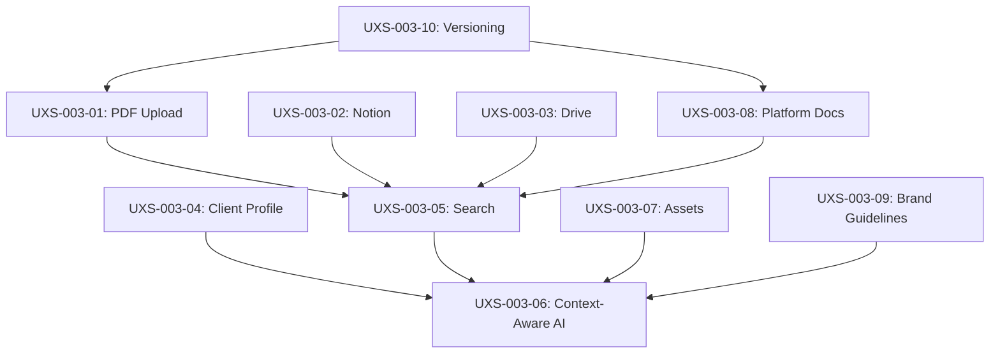

# UXS-003: Knowledge Management & RAG User Experience Stories

## Document Information

| Field | Value |
|-------|-------|
| **Document ID** | UXS-003 |
| **Feature** | Knowledge Management & RAG |
| **Category** | Core Platform Features |
| **Status** | Active |
| **Created** | 2025-01-11 |
| **Last Updated** | 2025-01-11 |
| **Owner** | QA Team |
| **Related PRDs** | PRD-012, PRD-017 |

---

## Overview

This document contains comprehensive user experience stories for the Knowledge Management and Retrieval-Augmented Generation (RAG) system in Bottleneck-Bots. These stories cover document ingestion, client profile creation, knowledge retrieval, context-aware AI responses, asset management, and brand guidelines application.

The RAG system enables AI agents to provide accurate, brand-consistent responses by referencing ingested documentation, client profiles, and organizational knowledge bases.

---

## UXS-003-01: Document Upload and Parsing (PDF)

### Story Information

| Field | Value |
|-------|-------|
| **Story ID** | UXS-003-01 |
| **Title** | Upload and Parse PDF Documentation |
| **Priority** | P0 - Critical |
| **Persona** | Agency User (Marcus) |

### Persona Description

Marcus is a digital marketing agency owner who manages 15 client accounts. He needs to upload client-provided documentation (proposals, brand guides, product specs) so that AI agents can reference accurate information when creating content and automating tasks.

### Scenario

Marcus received a 45-page brand guidelines PDF from his new client, Evergreen Properties. He needs to upload this document to the knowledge base so that all AI-generated content for this client maintains brand consistency. The PDF contains logo specifications, color palettes, typography rules, messaging guidelines, and prohibited language.

### User Goal

Upload a PDF document to the knowledge base and have it automatically parsed, chunked, and indexed for semantic search so AI agents can reference it during content generation.

### Preconditions

- [ ] User is authenticated and has an active subscription
- [ ] User has created a client profile for "Evergreen Properties"
- [ ] PDF document is less than 50MB in size
- [ ] PostgreSQL with pgvector extension is configured
- [ ] OpenAI API key is configured for embeddings

### Step-by-Step User Journey

| Step | User Action | System Response | Expected Result |
|------|-------------|-----------------|-----------------|
| 1 | Navigate to Knowledge Base section | Display Knowledge Base dashboard with tabs for Sources, Search, and Analytics | Knowledge Base page loads with empty or existing sources list |
| 2 | Click "Add Source" button | Display modal with upload options: File Upload, URL Import, Direct Input | Modal opens with File Upload tab active |
| 3 | Select "File Upload" option | Show drag-and-drop zone and file picker | File upload interface with supported formats listed (PDF, DOCX, TXT, MD) |
| 4 | Drag PDF file into upload zone | Show file name, size, and upload progress indicator | File appears in queue with "Uploading..." status |
| 5 | Wait for upload completion | Display parsing status: "Extracting text from PDF..." | Progress indicator shows extraction progress |
| 6 | Select client profile "Evergreen Properties" | Associate document with selected client | Client dropdown shows selection |
| 7 | Select category "Brand Guidelines" | Tag document with selected category | Category chip appears next to document |
| 8 | Add tags: "logo", "colors", "typography" | Add searchable tags to document | Tags appear as removable chips |
| 9 | Click "Process Document" | Display chunking progress and embedding generation | Status shows "Chunking... Creating embeddings... Indexing..." |
| 10 | Wait for processing completion | Display success message with document statistics | Toast: "Document processed: 45 pages, 127 chunks, ready for search" |
| 11 | View document in Sources list | Show document card with metadata and quick actions | Document appears with title, client, category, and chunk count |

### Expected Outcomes

- PDF is successfully uploaded and stored in cloud storage (S3/R2)
- Document text is extracted with preserved structure
- Content is chunked into 1000-character segments with 200-character overlap
- Vector embeddings are generated for each chunk using OpenAI text-embedding-3-small
- Document metadata is stored in PostgreSQL with client association
- Document appears in Knowledge Base with searchable tags
- AI agents can retrieve relevant chunks when queried about Evergreen Properties branding

### Acceptance Criteria

```gherkin
Feature: PDF Document Upload and Processing

Scenario: Successfully upload and process a PDF document
  Given I am logged in as an agency user
  And I have a client profile "Evergreen Properties" created
  When I navigate to the Knowledge Base section
  And I upload a PDF file "evergreen-brand-guide.pdf" (12MB)
  And I associate it with client "Evergreen Properties"
  And I select category "Brand Guidelines"
  And I add tags "logo, colors, typography"
  And I click "Process Document"
  Then the system should extract text from all 45 pages
  And create between 100-150 chunks based on content length
  And generate vector embeddings for each chunk
  And display success message within 60 seconds
  And the document should appear in the Sources list
  And each chunk should be searchable via semantic query

Scenario: Handle PDF extraction errors gracefully
  Given I am uploading a password-protected PDF
  When the system attempts to extract text
  Then display error message "Unable to extract text: PDF is password protected"
  And offer option to upload unprotected version
  And log the error for debugging

Scenario: Validate file size limits
  Given I am attempting to upload a PDF file
  When the file exceeds 50MB
  Then display error "File too large. Maximum size is 50MB"
  And prevent upload from starting
```

### Edge Cases

| Edge Case | Expected Behavior | Recovery Path |
|-----------|-------------------|---------------|
| Password-protected PDF | Display error and prompt for unprotected version | User provides unprotected file or password |
| Corrupted PDF file | Display error with file validation details | User uploads valid file |
| PDF with only images (scanned) | Extract via OCR if available, warn if not | Enable OCR option or upload text-based PDF |
| Network interruption during upload | Pause upload, offer resume option | Resume upload from last checkpoint |
| Processing timeout (>5 minutes) | Queue for background processing, notify when complete | Email notification with completion status |
| Duplicate document | Warn user, offer to replace or skip | User chooses to update or cancel |
| Unsupported PDF version | Display compatibility error | User converts to supported format |

### Test Data Requirements

```yaml
test_documents:
  valid_pdf:
    file: "test-brand-guidelines.pdf"
    size: "12MB"
    pages: 45
    expected_chunks: 127
    content_types: ["text", "headers", "lists", "tables"]

  large_pdf:
    file: "enterprise-documentation.pdf"
    size: "48MB"
    pages: 250
    expected_chunks: 650

  scanned_pdf:
    file: "scanned-document.pdf"
    size: "8MB"
    pages: 10
    content_type: "images_only"

  password_protected:
    file: "protected-doc.pdf"
    password: "test123"

  corrupted_file:
    file: "corrupted.pdf"
    expected_error: "File validation failed"

test_client:
  name: "Evergreen Properties"
  industry: "Real Estate"
  brand_voice: "Professional, warm, trustworthy"

test_categories:
  - "Brand Guidelines"
  - "Product Documentation"
  - "API Reference"
  - "Training Materials"
```

---

## UXS-003-02: Notion Workspace Integration

### Story Information

| Field | Value |
|-------|-------|
| **Story ID** | UXS-003-02 |
| **Title** | Connect and Sync Notion Workspace |
| **Priority** | P1 - High |
| **Persona** | Marketing Manager (Sarah) |

### Persona Description

Sarah is a marketing manager at a mid-sized agency who uses Notion as her team's central knowledge repository. She maintains SOPs, campaign playbooks, and client briefs in Notion and wants these automatically synced to Bottleneck-Bots so AI agents have access to the latest information.

### Scenario

Sarah's team maintains a comprehensive Notion workspace with 200+ pages covering campaign strategies, content templates, and client onboarding procedures. She wants to connect Notion to Bottleneck-Bots to eliminate manual copy-paste and ensure AI agents always have current information.

### User Goal

Connect Notion workspace via OAuth, select specific databases/pages for synchronization, and configure automatic sync schedules to keep knowledge base current.

### Preconditions

- [ ] User is authenticated with active subscription
- [ ] Notion workspace exists with content to sync
- [ ] User has admin access to Notion workspace
- [ ] Notion OAuth application is configured in platform settings
- [ ] Network connectivity to Notion API is available

### Step-by-Step User Journey

| Step | User Action | System Response | Expected Result |
|------|-------------|-----------------|-----------------|
| 1 | Navigate to Knowledge Base > Integrations | Display available integrations: Notion, Google Drive, Dropbox | Integrations page with connection status for each |
| 2 | Click "Connect Notion" button | Redirect to Notion OAuth authorization page | Notion login page opens in new window/tab |
| 3 | Log into Notion account | Display workspace selection | List of Notion workspaces user has access to |
| 4 | Select workspace "Agency Hub" | Display permission request for pages and databases | Permission dialog shows requested access |
| 5 | Click "Allow Access" | Return to Bottleneck-Bots with connection confirmation | Success toast: "Notion workspace connected" |
| 6 | View workspace structure | Display hierarchical tree of pages and databases | Expandable tree showing Notion content structure |
| 7 | Select pages/databases to sync | Check boxes next to selected items | Visual indication of selected items |
| 8 | Choose sync settings: frequency, client mapping | Configure: Every 6 hours, map to "Internal Knowledge" | Settings panel shows configuration |
| 9 | Click "Start Initial Sync" | Begin syncing selected content with progress indicator | Progress bar: "Syncing... 45/200 pages" |
| 10 | Wait for sync completion | Display sync summary with statistics | Summary: "Synced 200 pages, 1,847 chunks created" |
| 11 | View synced content in Sources | Display Notion content with source attribution | Sources list shows Notion items with logo icon |

### Expected Outcomes

- Notion OAuth connection is established and token stored securely
- Selected pages and databases are fetched via Notion API
- Notion blocks are converted to plain text with structure preserved
- Content is chunked and embedded following standard RAG pipeline
- Sync schedule is configured for automatic updates
- Notion source shows last sync time and status
- Changes in Notion are reflected in knowledge base on next sync
- Users can manually trigger sync at any time

### Acceptance Criteria

```gherkin
Feature: Notion Workspace Integration

Scenario: Connect Notion workspace via OAuth
  Given I am logged in as an agency user
  And I have a Notion workspace "Agency Hub"
  When I navigate to Knowledge Base > Integrations
  And I click "Connect Notion"
  And I authorize access in the Notion OAuth flow
  Then the system should store the OAuth token securely
  And display my Notion workspace structure
  And show connection status as "Connected"

Scenario: Select and sync specific Notion pages
  Given I have connected my Notion workspace
  When I select 50 pages from the content tree
  And I configure sync frequency to "Every 6 hours"
  And I click "Start Initial Sync"
  Then the system should fetch content for all 50 pages
  And convert Notion blocks to plain text
  And create vector embeddings for each chunk
  And display completion within 5 minutes
  And schedule next automatic sync

Scenario: Handle Notion API rate limits
  Given I am syncing a large Notion workspace (500+ pages)
  When the Notion API returns rate limit errors
  Then the system should implement exponential backoff
  And continue syncing after rate limit window expires
  And notify user of extended sync time
  And complete sync successfully within 30 minutes

Scenario: Sync updates only on subsequent syncs
  Given I have previously synced 200 Notion pages
  And 5 pages have been modified since last sync
  When automatic sync runs
  Then the system should only fetch the 5 modified pages
  And update embeddings for changed content only
  And complete incremental sync within 2 minutes
```

### Edge Cases

| Edge Case | Expected Behavior | Recovery Path |
|-----------|-------------------|---------------|
| OAuth token expires | Prompt user to re-authorize | Re-connect flow with preserved settings |
| Notion page deleted | Remove from knowledge base on next sync | Automatic cleanup with notification |
| Workspace access revoked | Display disconnected status | Prompt to reconnect or remove integration |
| Large database (10,000+ items) | Paginate and process in batches | Background processing with email notification |
| Nested page structure (10+ levels) | Flatten and process all levels | Handle recursively with depth tracking |
| Notion API downtime | Retry with backoff, notify user | Manual retry option with status updates |
| Content in unsupported block types | Skip unsupported, process remaining | Log skipped content for user review |

### Test Data Requirements

```yaml
notion_test_data:
  workspace:
    name: "Agency Hub"
    pages_count: 200
    databases_count: 5

  test_pages:
    - type: "Text page with headers"
      content_length: 5000
      expected_chunks: 6

    - type: "Database with 50 entries"
      fields: ["Name", "Description", "Status", "Tags"]
      expected_chunks: 75

    - type: "Nested pages (3 levels)"
      child_pages: 12
      expected_total_chunks: 45

  sync_scenarios:
    - initial_sync:
        pages: 200
        expected_time: "< 5 minutes"

    - incremental_sync:
        modified_pages: 5
        expected_time: "< 30 seconds"

  oauth_credentials:
    client_id: "test_notion_client"
    redirect_uri: "https://app.bottleneck-bots.com/integrations/notion/callback"
```

---

## UXS-003-03: Google Drive Document Import

### Story Information

| Field | Value |
|-------|-------|
| **Story ID** | UXS-003-03 |
| **Title** | Import Documents from Google Drive |
| **Priority** | P1 - High |
| **Persona** | Account Executive (James) |

### Persona Description

James is an account executive who collaborates with clients via Google Drive. Client proposals, contracts, and project briefs are stored in shared Drive folders. He needs to import these documents to the knowledge base so AI agents can reference client-specific information.

### Scenario

James has a Google Drive folder "Client Projects/Acme Corp" containing 15 documents including the master services agreement, project proposals, and quarterly reports. He wants to import these documents with a single action and keep them synced as clients update shared files.

### User Goal

Connect Google Drive, browse folders, select documents for import, and configure sync settings to maintain current knowledge base content.

### Preconditions

- [ ] User is authenticated with active subscription
- [ ] Google Drive contains documents to import
- [ ] User has read access to selected Drive folders
- [ ] Google OAuth application is configured
- [ ] Supported file types: Google Docs, Sheets, PDF, DOCX, TXT

### Step-by-Step User Journey

| Step | User Action | System Response | Expected Result |
|------|-------------|-----------------|-----------------|
| 1 | Navigate to Knowledge Base > Integrations | Display integration options | Google Drive shown as available integration |
| 2 | Click "Connect Google Drive" | Redirect to Google OAuth consent screen | Google account selection page |
| 3 | Select Google account and authorize | Display scope permissions request | Clear explanation of requested permissions |
| 4 | Grant read access to Drive | Return to Bottleneck-Bots | Success: "Google Drive connected" |
| 5 | Click "Browse Drive" | Display folder structure from user's Drive | Hierarchical folder view with file counts |
| 6 | Navigate to "Client Projects/Acme Corp" | Expand folder to show contents | List of 15 documents with types and dates |
| 7 | Select all documents in folder | Check all items, show selection count | "15 documents selected (45MB total)" |
| 8 | Associate with client "Acme Corporation" | Link documents to client profile | Client badge appears next to selection |
| 9 | Enable "Auto-sync on file changes" | Configure Drive webhook integration | Toggle enabled with sync indicator |
| 10 | Click "Import Selected" | Begin import with progress tracking | Progress: "Importing... 8/15 documents" |
| 11 | View import results | Display success/failure summary | "14 documents imported, 1 failed (unsupported format)" |
| 12 | Review imported content | Navigate to Sources filtered by Drive | Documents listed with Drive icon and metadata |

### Expected Outcomes

- Google Drive OAuth connection established securely
- Selected documents are downloaded and converted to text
- Google Docs/Sheets are exported to compatible format
- PDFs and DOCX files are processed through standard pipeline
- Documents are chunked and embedded for vector search
- Sync webhooks are registered for auto-update
- Import history is logged for audit trail
- Failed imports are logged with actionable error messages

### Acceptance Criteria

```gherkin
Feature: Google Drive Document Import

Scenario: Import multiple documents from Google Drive folder
  Given I have connected my Google Drive
  And I have a folder "Client Projects/Acme Corp" with 15 documents
  When I navigate to the folder in the Drive browser
  And I select all documents
  And I associate them with client "Acme Corporation"
  And I click "Import Selected"
  Then the system should download all supported documents
  And convert Google Docs to plain text
  And process PDFs through the extraction pipeline
  And create vector embeddings for all content
  And display import summary within 3 minutes
  And show documents in the Sources list with Drive attribution

Scenario: Handle unsupported file types gracefully
  Given I am importing files from Google Drive
  And the selection includes an unsupported file type (video file)
  When the import process runs
  Then the system should skip the unsupported file
  And process all supported files successfully
  And display warning: "1 file skipped: video.mp4 (unsupported format)"
  And provide list of supported formats

Scenario: Auto-sync when Drive files are modified
  Given I have imported documents with auto-sync enabled
  And a document is edited in Google Drive
  When the Drive webhook notifies the system
  Then the system should fetch the updated document
  And re-process only the changed content
  And update vector embeddings accordingly
  And log the sync event with timestamp
```

### Edge Cases

| Edge Case | Expected Behavior | Recovery Path |
|-----------|-------------------|---------------|
| Shared Drive (Team Drive) access | Support Team Drives with proper scopes | Request additional permissions if needed |
| File larger than 100MB | Skip with warning, offer manual download | User exports smaller version |
| Google Sheets with multiple tabs | Process all tabs as separate chunks | Metadata indicates tab source |
| Trashed files in selection | Exclude trashed files automatically | Notify user of exclusions |
| Permission removed after import | Mark source as "Access revoked" | Prompt to re-authorize or remove |
| Conflicting file names | Append unique identifier to title | Display original name in metadata |
| Rate limit from Google API | Implement backoff and retry | Queue remaining files for later |

### Test Data Requirements

```yaml
google_drive_test_data:
  test_folder:
    path: "Client Projects/Test Client"
    files:
      - name: "Master Agreement.pdf"
        type: "application/pdf"
        size: "2.5MB"

      - name: "Project Proposal"
        type: "application/vnd.google-apps.document"
        size: "estimated 50KB"

      - name: "Budget Tracker"
        type: "application/vnd.google-apps.spreadsheet"
        tabs: 3

      - name: "Meeting Notes.docx"
        type: "application/vnd.openxmlformats-officedocument"
        size: "150KB"

      - name: "Unsupported.mp4"
        type: "video/mp4"
        expected: "skip"

  sync_test:
    initial_document: "Project Proposal"
    modification: "Add new paragraph"
    expected_resync_time: "< 30 seconds"

  oauth_config:
    scopes:
      - "https://www.googleapis.com/auth/drive.readonly"
      - "https://www.googleapis.com/auth/drive.metadata.readonly"
```

---

## UXS-003-04: Client Profile Creation with Brand Voice

### Story Information

| Field | Value |
|-------|-------|
| **Story ID** | UXS-003-04 |
| **Title** | Create Client Profile with Brand Voice Configuration |
| **Priority** | P0 - Critical |
| **Persona** | Agency Owner (Lisa) |

### Persona Description

Lisa runs a boutique marketing agency and is onboarding a new client, "Urban Fitness Studios." She needs to create a comprehensive client profile that captures their brand voice, business goals, and communication preferences so all AI-generated content aligns with the client's identity.

### Scenario

Lisa just signed Urban Fitness Studios as a new client. Before assigning tasks to AI agents, she needs to set up their profile with brand voice parameters, target audience information, and content guidelines. The client has a casual, energetic brand with specific do's and don'ts for marketing copy.

### User Goal

Create a detailed client profile with brand voice settings, business context, and preferences that AI agents will use to generate personalized, on-brand content.

### Preconditions

- [ ] User is authenticated with active subscription
- [ ] User has completed platform onboarding
- [ ] Client information is available (name, website, industry)
- [ ] Brand guidelines document is available (optional)

### Step-by-Step User Journey

| Step | User Action | System Response | Expected Result |
|------|-------------|-----------------|-----------------|
| 1 | Navigate to Clients section | Display client list with "Add Client" button | Client management page loads |
| 2 | Click "Add Client" button | Open client profile creation wizard | Multi-step wizard modal opens |
| 3 | Enter basic info: name, website, industry | Validate inputs, show preview | "Urban Fitness Studios" / fitness-studios.com / Health & Fitness |
| 4 | Click "Next: Brand Voice" | Display brand voice configuration panel | Tone sliders and word preference inputs |
| 5 | Set tone parameters: Formality (30%), Enthusiasm (85%), Confidence (75%) | Visualize tone on radar chart | Dynamic radar chart updates |
| 6 | Add preferred vocabulary: "crushing it", "gains", "community" | Display as editable chips | Words appear as green chips |
| 7 | Add words to avoid: "cheap", "diet", "pain" | Display as editable chips | Words appear as red chips |
| 8 | Add example phrases from client | Store as brand voice examples | Examples listed with context |
| 9 | Click "Next: Business Goals" | Display goals and target audience section | Goal selection and persona builder |
| 10 | Set primary goal: "Increase membership signups by 40%" | Store goal as measurable objective | Goal appears with progress placeholder |
| 11 | Define target audience: "Young professionals 25-40, urban, health-conscious" | Store audience persona | Persona card displays summary |
| 12 | Click "Next: Integrations" | Show GHL subaccount linking | Integration options display |
| 13 | Link GHL subaccount | Associate profile with GHL | GHL badge shows connection |
| 14 | Click "Create Client" | Save profile and confirm creation | Success: "Client profile created" |
| 15 | View client dashboard | Display profile with all configured settings | Complete profile with edit options |

### Expected Outcomes

- Client profile is created with all required fields populated
- Brand voice parameters are stored as structured JSON
- Vocabulary preferences are indexed for AI prompt augmentation
- Business goals are captured for strategic AI recommendations
- GHL subaccount is linked for integration workflows
- Profile is immediately available for client context switching
- AI agents include brand voice in system prompts
- Profile appears in client selector dropdown

### Acceptance Criteria

```gherkin
Feature: Client Profile Creation with Brand Voice

Scenario: Create comprehensive client profile
  Given I am logged in as an agency user
  When I navigate to the Clients section
  And I click "Add Client"
  And I enter client name "Urban Fitness Studios"
  And I enter website "fitness-studios.com"
  And I select industry "Health & Fitness"
  And I configure brand voice with formality 30%, enthusiasm 85%
  And I add preferred words "crushing it, gains, community"
  And I add avoided words "cheap, diet, pain"
  And I set primary goal "Increase membership signups by 40%"
  And I click "Create Client"
  Then the system should save the complete client profile
  And display success confirmation
  And the client should appear in the client list
  And be selectable as active client context
  And AI prompts should include brand voice parameters

Scenario: AI uses brand voice in content generation
  Given I have created a client profile for "Urban Fitness Studios"
  And I have set the active client context to "Urban Fitness Studios"
  When I ask the AI to "Write a promotional email for January membership specials"
  Then the generated content should use casual, enthusiastic tone
  And include preferred vocabulary where appropriate
  And avoid any words from the avoid list
  And match the target audience persona

Scenario: Validate required fields
  Given I am creating a new client profile
  When I attempt to save without entering client name
  Then the system should display error "Client name is required"
  And prevent form submission
  And highlight the missing field
```

### Edge Cases

| Edge Case | Expected Behavior | Recovery Path |
|-----------|-------------------|---------------|
| Duplicate client name | Warn user, allow creation with suffix | Auto-suggest unique name or allow duplicate |
| Very long brand voice description | Accept up to 5000 characters | Truncation warning if exceeded |
| Special characters in name | Sanitize for URL-safe slug | Display sanitized slug preview |
| Empty brand voice (skipped step) | Create with default neutral tone | Allow editing later |
| Invalid website URL | Validate format, allow without http | Auto-prepend https:// if missing |
| GHL subaccount not found | Display connection error | Offer manual ID entry |
| Concurrent profile creation | Handle race condition | Second save fails with conflict message |

### Test Data Requirements

```yaml
client_profile_test_data:
  valid_profile:
    name: "Urban Fitness Studios"
    website: "https://fitness-studios.com"
    industry: "Health & Fitness"
    brand_voice:
      formality: 30
      enthusiasm: 85
      confidence: 75
      friendliness: 80
    preferred_words:
      - "crushing it"
      - "gains"
      - "community"
      - "transformation"
    avoided_words:
      - "cheap"
      - "diet"
      - "pain"
      - "unfortunately"
    example_phrases:
      - context: "Email greeting"
        phrase: "Ready to crush your fitness goals?"
      - context: "CTA"
        phrase: "Join the community today!"
    primary_goal: "Increase membership signups by 40%"
    target_audience: "Young professionals 25-40, urban, health-conscious"
    ghl_subaccount_id: "ghl_urban123"

  minimal_profile:
    name: "Test Client"
    website: ""
    industry: "Other"

  brand_voice_templates:
    professional:
      formality: 80
      enthusiasm: 50
      example: "We appreciate your business"

    casual_friendly:
      formality: 25
      enthusiasm: 70
      example: "Hey there! Let's get started"
```

---

## UXS-003-05: Knowledge Base Search and Retrieval

### Story Information

| Field | Value |
|-------|-------|
| **Story ID** | UXS-003-05 |
| **Title** | Search Knowledge Base with Semantic Queries |
| **Priority** | P0 - Critical |
| **Persona** | Content Specialist (Alex) |

### Persona Description

Alex is a content specialist who creates marketing materials for multiple clients. Before writing new content, Alex searches the knowledge base to find relevant client information, past campaigns, and brand guidelines to ensure consistency.

### Scenario

Alex is creating a social media campaign for a real estate client. Before writing ad copy, they need to search the knowledge base for the client's brand voice guidelines, target audience demographics, and examples of successful past campaigns.

### User Goal

Quickly find relevant information across all knowledge base sources using natural language queries, with results ranked by relevance and filtered by client, category, or source type.

### Preconditions

- [ ] Knowledge base contains ingested documents
- [ ] Vector embeddings have been generated for all content
- [ ] User has active client context set (optional)
- [ ] Search index is available (pgvector HNSW index)

### Step-by-Step User Journey

| Step | User Action | System Response | Expected Result |
|------|-------------|-----------------|-----------------|
| 1 | Navigate to Knowledge Base > Search | Display search interface with filter options | Search page with query input and filters |
| 2 | Type query: "real estate brand voice and target audience" | Show autocomplete suggestions | Suggestions based on common queries |
| 3 | Press Enter to search | Execute vector similarity search | Loading indicator while searching |
| 4 | View search results | Display ranked results with relevance scores | Top 10 results with similarity percentages |
| 5 | Review first result (92% match) | Expand to show full chunk content | Full text with query terms highlighted |
| 6 | Click "View Source" | Navigate to source document details | Source page with all chunks and metadata |
| 7 | Apply filter: Client = "Sunset Realty" | Refine results to specific client | Results filtered to selected client |
| 8 | Apply filter: Category = "Brand Guidelines" | Further narrow results | Combined filters applied |
| 9 | Click "Copy to Clipboard" on relevant chunk | Copy text content | Toast: "Copied to clipboard" |
| 10 | Click "Use in AI Chat" | Pre-fill AI chat with context | AI chat opens with context attached |
| 11 | Save search as bookmark | Store query for quick access | Bookmark saved to user's collection |

### Expected Outcomes

- Natural language query is converted to vector embedding
- Semantic search returns top K results ranked by cosine similarity
- Results include relevance score, source information, and preview
- Filters allow narrowing by client, category, date, and source type
- Full chunk content is viewable with context
- Results can be copied or used in AI interactions
- Search history is maintained for quick re-access
- Zero results provide helpful suggestions

### Acceptance Criteria

```gherkin
Feature: Knowledge Base Semantic Search

Scenario: Execute semantic search with natural language query
  Given I have documents in the knowledge base for client "Sunset Realty"
  And the documents include brand guidelines and campaign materials
  When I enter search query "real estate brand voice and target audience"
  And I press Enter
  Then the system should return results within 500ms
  And display results ranked by similarity score
  And show at least 1 result with > 70% similarity
  And display source name and category for each result
  And highlight relevant text in result previews

Scenario: Filter search results by client
  Given I have search results from multiple clients
  When I select filter "Client: Sunset Realty"
  Then results should only show content from "Sunset Realty"
  And the result count should update accordingly
  And filters should be removable

Scenario: Handle zero results gracefully
  Given I search for a term that has no matches
  When I enter "xyz123nonexistent"
  Then the system should display "No results found"
  And suggest: "Try different keywords or remove filters"
  And offer to search across all clients
  And show recently added sources as alternatives

Scenario: Search performance under load
  Given the knowledge base contains 100,000+ chunks
  When I execute a search query
  Then results should return within 1 second
  And relevance ranking should remain accurate
  And pagination should work for large result sets
```

### Edge Cases

| Edge Case | Expected Behavior | Recovery Path |
|-----------|-------------------|---------------|
| Empty query submitted | Prompt to enter search terms | Show recent searches as suggestions |
| Very short query (1 word) | Execute search, may have lower relevance | Suggest more descriptive query |
| Query in different language | Attempt multilingual embedding match | Note: Best results in English |
| Special characters in query | Sanitize input, execute search | Handle quotes, symbols gracefully |
| No active client filter | Search across all clients | Clearly label results by client |
| Search while indexing | Show available results with notice | "Some content still indexing" |
| Embedding service unavailable | Fall back to keyword search | Display degraded mode warning |

### Test Data Requirements

```yaml
search_test_data:
  test_queries:
    - query: "real estate brand voice and target audience"
      expected_results: "> 5"
      expected_top_similarity: "> 0.75"

    - query: "How do I create a contact in GHL?"
      expected_results: "> 3"
      expected_platform: "gohighlevel"

    - query: "email marketing best practices for healthcare"
      expected_results: "> 2"
      expected_category: "Best Practices"

    - query: "nonexistent query 12345xyz"
      expected_results: 0

  test_documents:
    - title: "Real Estate Marketing Guide"
      client: "Sunset Realty"
      category: "Brand Guidelines"
      chunks: 45

    - title: "GoHighLevel API Documentation"
      platform: "gohighlevel"
      category: "API"
      chunks: 120

  performance_test:
    total_chunks: 100000
    expected_search_time: "< 1000ms"
    concurrent_searches: 50
```

---

## UXS-003-06: Context-Aware Agent Responses

### Story Information

| Field | Value |
|-------|-------|
| **Story ID** | UXS-003-06 |
| **Title** | AI Agent Provides Context-Aware Responses Using RAG |
| **Priority** | P0 - Critical |
| **Persona** | Agency Automation Specialist (Taylor) |

### Persona Description

Taylor sets up automation workflows and trains AI agents to handle client requests. They rely on the AI to provide accurate, contextual responses based on ingested documentation and client profiles, reducing manual intervention.

### Scenario

Taylor is testing an AI agent configured for a SaaS client. A user asks the agent "How do I cancel my subscription?" The agent should retrieve the relevant cancellation policy from the knowledge base and respond accurately in the client's brand voice.

### User Goal

Verify that AI agents automatically retrieve relevant knowledge base content to inform responses, cite sources, and maintain brand voice consistency.

### Preconditions

- [ ] Client profile exists with brand voice configured
- [ ] Relevant documentation is ingested (e.g., FAQ, policies)
- [ ] RAG pipeline is active for the AI agent
- [ ] Client context is set as active

### Step-by-Step User Journey

| Step | User Action | System Response | Expected Result |
|------|-------------|-----------------|-----------------|
| 1 | Open AI Chat for client "TechFlow SaaS" | Load chat interface with client context | Header shows active client, brand tone loaded |
| 2 | Type: "How do I cancel my subscription?" | Show typing indicator | "Agent is thinking..." |
| 3 | Wait for response | Agent retrieves relevant docs via RAG | Internal: Query knowledge base for cancellation policy |
| 4 | View agent response | Display response with retrieved context | Response explains cancellation process accurately |
| 5 | Observe brand voice | Response uses configured tone | Friendly, helpful tone matching TechFlow's voice |
| 6 | Click "View Sources" | Expand to show retrieved chunks | Shows "Cancellation Policy" doc with 89% similarity |
| 7 | Verify accuracy | Compare response to source document | Response matches official policy |
| 8 | Rate response quality | Click thumbs up/down | Feedback recorded for learning |
| 9 | Ask follow-up: "What about refunds?" | Agent retrieves refund policy | Response includes refund timeframes |
| 10 | View conversation history | Review full exchange | All responses show source attribution |

### Expected Outcomes

- AI agent automatically queries knowledge base for relevant content
- Retrieved chunks are included in agent's context window
- Response accurately reflects ingested documentation
- Brand voice parameters influence response tone and style
- Source attribution is available for transparency
- Responses cite specific documents when applicable
- Follow-up questions maintain conversational context
- Feedback is captured for continuous improvement

### Acceptance Criteria

```gherkin
Feature: Context-Aware AI Agent Responses

Scenario: Agent retrieves relevant documentation for user query
  Given I have client "TechFlow SaaS" with cancellation policy in knowledge base
  And the client has a friendly, helpful brand voice configured
  When a user asks "How do I cancel my subscription?"
  Then the AI agent should query the knowledge base
  And retrieve the cancellation policy document
  And generate a response based on the retrieved content
  And apply the configured brand voice to the response
  And include source attribution when clicked
  And respond within 3 seconds

Scenario: Agent maintains context across conversation
  Given the user has asked about cancellation
  And received an accurate response
  When the user asks "What about refunds?"
  Then the agent should understand the context
  And retrieve refund policy from knowledge base
  And provide continuation of the conversation
  And not require user to repeat context

Scenario: Agent handles queries with no matching knowledge
  Given the knowledge base does not contain information about "product X"
  When a user asks "What are the features of product X?"
  Then the agent should indicate the information is not available
  And offer to escalate to human support
  And not fabricate an answer
  And log the gap for knowledge base improvement

Scenario: Brand voice is applied correctly
  Given client "TechFlow SaaS" has formality=25% and enthusiasm=70%
  When the agent generates a response
  Then the response should use casual language
  And include encouraging phrases
  And avoid overly formal terms
  And match the brand voice examples provided
```

### Edge Cases

| Edge Case | Expected Behavior | Recovery Path |
|-----------|-------------------|---------------|
| No relevant documents found | Provide general response, offer escalation | Log query for knowledge gap analysis |
| Multiple conflicting sources | Use most recent and authoritative source | Indicate if information may vary |
| Outdated documentation | Use latest version, note if outdated flag set | Warn if source is > 6 months old |
| Very long retrieved context | Summarize key points, offer full details | Link to full source document |
| Technical jargon in docs | Simplify based on user context | Offer "explain like I'm new" option |
| Agent confidence low | Request clarification from user | "Did you mean X or Y?" |
| Rate limit on AI API | Queue response, notify user of delay | Retry with backoff |

### Test Data Requirements

```yaml
rag_agent_test_data:
  client_profile:
    name: "TechFlow SaaS"
    brand_voice:
      formality: 25
      enthusiasm: 70
      friendliness: 80
    tone_examples:
      - "Happy to help you with that!"
      - "No problem at all, here's what you need to know..."

  knowledge_base_documents:
    - title: "Cancellation Policy"
      content: |
        How to Cancel Your Subscription:
        1. Go to Account Settings
        2. Click "Subscription"
        3. Select "Cancel Subscription"
        4. Confirm cancellation

        Note: Cancellations take effect at end of billing period.
        No partial refunds for unused time.
      similarity_threshold: 0.8

    - title: "Refund Policy"
      content: |
        Refunds are available within 14 days of purchase.
        To request a refund, contact support@techflow.com.
        Refunds are processed within 5-7 business days.
      similarity_threshold: 0.75

  test_queries:
    - query: "How do I cancel my subscription?"
      expected_source: "Cancellation Policy"
      expected_response_includes: ["Account Settings", "Subscription"]

    - query: "Can I get a refund?"
      expected_source: "Refund Policy"
      expected_response_includes: ["14 days", "contact support"]

    - query: "What is product X?"
      expected_source: null
      expected_response_includes: ["don't have information", "help you further"]
```

---

## UXS-003-07: Asset Library Management

### Story Information

| Field | Value |
|-------|-------|
| **Story ID** | UXS-003-07 |
| **Title** | Upload and Organize Client Digital Assets |
| **Priority** | P1 - High |
| **Persona** | Creative Director (Morgan) |

### Persona Description

Morgan oversees creative production for the agency and manages digital assets (logos, images, templates) for all clients. They need a centralized asset library where team members can quickly find and use the right assets for each client's projects.

### Scenario

Morgan is setting up the asset library for a new hospitality client, "Oceanview Resorts." They need to upload the client's logo variants, hero images, property photos, and brand color palette reference images, all properly tagged for easy retrieval by the team and AI agents.

### User Goal

Upload, organize, and tag digital assets by client and context so that team members and AI agents can quickly locate and use appropriate assets for content creation.

### Preconditions

- [ ] Client profile exists for "Oceanview Resorts"
- [ ] Assets are available in supported formats (PNG, JPG, SVG, PDF)
- [ ] Cloud storage (S3/R2) is configured
- [ ] User has permissions to manage assets

### Step-by-Step User Journey

| Step | User Action | System Response | Expected Result |
|------|-------------|-----------------|-----------------|
| 1 | Navigate to Client > Oceanview Resorts > Assets | Display asset library for client | Empty state with "Upload Assets" prompt |
| 2 | Click "Upload Assets" button | Open bulk upload modal | Drag-drop zone with format guidelines |
| 3 | Drag 12 image files into upload zone | Display file queue with previews | All files listed with thumbnails |
| 4 | Wait for upload completion | Upload to cloud storage with progress | Progress bars complete for all files |
| 5 | View uploaded assets | Display assets in grid view | 12 assets shown with processing status |
| 6 | Select first asset (logo) | Open asset detail panel | Asset preview with metadata form |
| 7 | Set context tag: "LOGO" | Update asset categorization | Logo badge appears on asset |
| 8 | Add alt text: "Oceanview Resorts primary logo" | Save accessibility text | Alt text saved and displayed |
| 9 | Bulk select 4 property photos | Enable multi-select mode | 4 assets highlighted |
| 10 | Apply bulk tag: "PROPERTY" | Update all selected assets | Property badge on all 4 assets |
| 11 | Filter by tag: "LOGO" | Display only logo assets | 1 asset shown (logo) |
| 12 | Search: "pool" | Filter by filename/alt text | Assets matching "pool" displayed |
| 13 | Click "Download Original" on asset | Download original file | File downloads to local machine |
| 14 | Click "Copy URL" | Copy CDN URL to clipboard | Toast: "URL copied" |

### Expected Outcomes

- Assets are uploaded to cloud storage with optimized versions created
- Each asset has required metadata (alt text, context tag, status)
- Assets are associated with specific client profile
- Context tags enable semantic retrieval (LOGO, HERO, TEAM, etc.)
- Grid and list views available for browsing
- Search and filter functionality works across all assets
- CDN URLs are available for use in content
- AI agents can reference assets by context tag

### Acceptance Criteria

```gherkin
Feature: Asset Library Management

Scenario: Upload multiple assets with bulk tagging
  Given I have client profile "Oceanview Resorts"
  When I navigate to the client's Assets section
  And I drag 12 image files into the upload zone
  And I wait for upload completion
  And I bulk select 4 property photos
  And I apply context tag "PROPERTY"
  Then all 12 assets should be uploaded to cloud storage
  And optimized versions should be generated
  And 4 selected assets should have "PROPERTY" tag
  And assets should appear in the client's asset grid

Scenario: Search and filter assets
  Given I have 50 assets for client "Oceanview Resorts"
  And assets have various context tags
  When I filter by tag "LOGO"
  Then only logo assets should be displayed
  When I search for "pool"
  Then only assets with "pool" in name or alt text should be displayed
  And filter and search should be combinable

Scenario: AI agent retrieves appropriate asset
  Given I have assets tagged with context tags
  And the AI agent is generating a hero email for Oceanview Resorts
  When the agent needs a hero image
  Then it should request assets with tag "HERO"
  And receive CDN URLs for matching assets
  And include asset in generated content

Scenario: Asset optimization on upload
  Given I am uploading a 5MB PNG image
  When the upload completes
  Then the system should create an optimized version
  And maintain the original for download
  And display optimization status "Ready"
  And show both original and optimized file sizes
```

### Edge Cases

| Edge Case | Expected Behavior | Recovery Path |
|-----------|-------------------|---------------|
| Unsupported file format | Display error, skip unsupported | List supported formats |
| File too large (> 50MB) | Reject with size error | Suggest compression tools |
| Duplicate file upload | Warn and offer to skip or replace | User chooses action |
| Upload interruption | Save partially uploaded, offer resume | Resume option in queue |
| Missing alt text | Flag as incomplete, remind user | Bulk alt text editor |
| CDN delivery failure | Fall back to direct URL | Retry CDN upload |
| Bulk operation timeout | Process in background | Email notification on completion |

### Test Data Requirements

```yaml
asset_library_test_data:
  test_client:
    name: "Oceanview Resorts"
    industry: "Hospitality"

  test_assets:
    - filename: "oceanview-logo-primary.png"
      type: "image/png"
      size: "500KB"
      context_tag: "LOGO"
      alt_text: "Oceanview Resorts primary logo"

    - filename: "beach-hero.jpg"
      type: "image/jpeg"
      size: "3MB"
      context_tag: "HERO"
      alt_text: "Oceanview Resorts beachfront view"

    - filename: "property-pool-1.jpg"
      type: "image/jpeg"
      size: "2.5MB"
      context_tag: "PROPERTY"
      alt_text: "Resort pool area"

    - filename: "team-manager.jpg"
      type: "image/jpeg"
      size: "1MB"
      context_tag: "TEAM"
      alt_text: "Hotel manager portrait"

  context_tags:
    - "LOGO"
    - "HERO"
    - "TEAM"
    - "TESTIMONIAL"
    - "PRODUCT"
    - "PROPERTY"
    - "UNKNOWN"

  upload_limits:
    max_file_size: "50MB"
    supported_formats: ["png", "jpg", "jpeg", "svg", "gif", "webp", "pdf"]
```

---

## UXS-003-08: Platform Documentation Ingestion

### Story Information

| Field | Value |
|-------|-------|
| **Story ID** | UXS-003-08 |
| **Title** | Ingest and Index Platform API Documentation |
| **Priority** | P0 - Critical |
| **Persona** | Platform Administrator (Chris) |

### Persona Description

Chris is the platform administrator responsible for ensuring AI agents have access to accurate, up-to-date documentation for integrated platforms like GoHighLevel, Stripe, and Cloudflare. They manage the ingestion of official API docs and ensure agents can provide accurate guidance.

### Scenario

Chris needs to ingest the complete GoHighLevel API documentation so that AI agents can accurately answer questions about GHL features, API endpoints, and automation capabilities. The documentation is available at multiple URLs and needs to be crawled, processed, and indexed.

### User Goal

Bulk ingest platform documentation from URLs, properly categorize by platform and topic, and enable AI agents to provide accurate technical guidance.

### Preconditions

- [ ] Administrator access to platform settings
- [ ] Target documentation URLs are accessible
- [ ] Platform keywords are seeded (gohighlevel, stripe, etc.)
- [ ] Web crawler service is available

### Step-by-Step User Journey

| Step | User Action | System Response | Expected Result |
|------|-------------|-----------------|-----------------|
| 1 | Navigate to Admin > Knowledge Management | Display admin knowledge panel | Platform documentation management interface |
| 2 | Click "Add Platform Docs" | Open documentation ingestion wizard | Form for URL and platform configuration |
| 3 | Enter platform: "GoHighLevel" | Load platform-specific settings | Category options and keyword suggestions |
| 4 | Enter root URL: "https://highlevel.stoplight.io/docs/integrations" | Validate URL accessibility | "URL accessible" status indicator |
| 5 | Enable "Crawl subpages" option | Configure crawl depth and limits | Set depth = 3, max pages = 500 |
| 6 | Set categories: "API Reference", "Webhooks", "OAuth" | Create category structure | Categories added as tabs |
| 7 | Click "Start Ingestion" | Begin crawling with progress display | Progress: "Discovering pages... Found 156 pages" |
| 8 | Monitor crawl progress | Update page count and status | "Crawling... 78/156 pages processed" |
| 9 | View content extraction status | Display parsing and chunking progress | "Extracting content... Creating embeddings..." |
| 10 | Wait for completion | Show summary with statistics | "Ingested 156 pages, 2,340 chunks, 45 minutes" |
| 11 | Review ingested sources | Display documentation tree by category | Hierarchical view of all ingested pages |
| 12 | Test with search query | Search "How to create contact GHL" | Relevant results from ingested docs |
| 13 | Schedule refresh | Set weekly refresh schedule | "Scheduled: Every Sunday 2:00 AM" |

### Expected Outcomes

- All accessible pages from documentation site are crawled
- Content is extracted with structure preserved (headers, code blocks)
- Pages are categorized by platform and topic
- Vector embeddings enable semantic search
- Platform keywords improve search relevance
- Automatic refresh keeps docs current
- AI agents can answer platform-specific questions accurately
- Documentation versions are tracked

### Acceptance Criteria

```gherkin
Feature: Platform Documentation Ingestion

Scenario: Ingest GoHighLevel API documentation
  Given I am logged in as a platform administrator
  When I navigate to Admin > Knowledge Management
  And I click "Add Platform Docs"
  And I enter platform "GoHighLevel"
  And I enter URL "https://highlevel.stoplight.io/docs/integrations"
  And I enable "Crawl subpages" with depth 3
  And I click "Start Ingestion"
  Then the system should discover all linked pages (up to 500)
  And extract content from each page
  And create chunked embeddings for all content
  And complete ingestion within 60 minutes
  And display summary with page and chunk counts

Scenario: AI accurately answers GHL questions after ingestion
  Given GoHighLevel documentation has been ingested
  When a user asks "How do I create a contact in GHL API?"
  Then the AI should retrieve relevant API documentation
  And provide accurate endpoint information
  And include request/response examples from docs
  And cite the source documentation page

Scenario: Handle documentation site changes
  Given documentation was ingested 7 days ago
  And the scheduled refresh runs
  When the system re-crawls the documentation site
  Then it should detect new and modified pages
  And update embeddings for changed content
  And remove chunks for deleted pages
  And log changes for admin review

Scenario: Rate limiting during crawl
  Given I am ingesting a large documentation site
  When the target site enforces rate limits
  Then the system should respect rate limit headers
  And implement exponential backoff
  And continue crawling without being blocked
  And complete ingestion with extended time estimate
```

### Edge Cases

| Edge Case | Expected Behavior | Recovery Path |
|-----------|-------------------|---------------|
| Documentation behind authentication | Prompt for credentials or skip | Support API key or Basic auth |
| JavaScript-rendered content | Use headless browser for rendering | Fall back to static crawl |
| Broken links in documentation | Log and skip, continue with valid pages | Report broken links to admin |
| Extremely large site (10,000+ pages) | Process in batches with checkpoints | Resume from last checkpoint |
| Content in multiple languages | Process all, tag by language | Language filter in search |
| Documentation site restructure | Re-crawl with change detection | Admin review of major changes |
| Robots.txt restrictions | Respect disallow rules | Notify admin of restricted content |

### Test Data Requirements

```yaml
platform_docs_test_data:
  platforms:
    - name: "GoHighLevel"
      root_url: "https://highlevel.stoplight.io/docs/integrations"
      expected_pages: 156
      categories:
        - "API Reference"
        - "Webhooks"
        - "OAuth"
        - "Guides"
      keywords:
        - "gohighlevel"
        - "highlevel"
        - "ghl"
        - "contacts"
        - "pipelines"

    - name: "Stripe"
      root_url: "https://stripe.com/docs/api"
      expected_pages: 200
      categories:
        - "API Reference"
        - "Webhooks"
        - "Checkout"

    - name: "Cloudflare"
      root_url: "https://developers.cloudflare.com/dns"
      expected_pages: 50
      categories:
        - "DNS"
        - "Workers"
        - "Security"

  crawl_settings:
    max_depth: 3
    max_pages: 500
    rate_limit: "2 requests/second"
    timeout: 30000

  test_queries:
    - query: "How do I create a contact in GHL?"
      expected_platform: "gohighlevel"
      expected_category: "API Reference"

    - query: "Stripe webhook verification"
      expected_platform: "stripe"
      expected_category: "Webhooks"
```

---

## UXS-003-09: Brand Guidelines Storage and Application

### Story Information

| Field | Value |
|-------|-------|
| **Story ID** | UXS-003-09 |
| **Title** | Store and Apply Brand Guidelines to AI Content |
| **Priority** | P0 - Critical |
| **Persona** | Brand Manager (Jordan) |

### Persona Description

Jordan is a brand manager responsible for maintaining brand consistency across all client communications. They need to ensure that AI-generated content adheres to client brand guidelines, including color specifications, typography rules, messaging frameworks, and visual identity standards.

### Scenario

Jordan is onboarding "Apex Financial Services" and needs to upload their comprehensive brand guidelines. The guidelines include strict rules about financial disclaimers, approved terminology for investment products, and a formal communication style that all AI-generated content must follow.

### User Goal

Upload and configure detailed brand guidelines that AI agents will automatically reference and apply when generating content for the client.

### Preconditions

- [ ] Client profile exists for "Apex Financial Services"
- [ ] Brand guidelines document is available (PDF or text)
- [ ] User has brand management permissions
- [ ] AI content generation features are enabled

### Step-by-Step User Journey

| Step | User Action | System Response | Expected Result |
|------|-------------|-----------------|-----------------|
| 1 | Navigate to Client > Apex Financial > Brand Settings | Display brand configuration panel | Brand settings page with sections |
| 2 | Click "Upload Brand Guidelines PDF" | Open file upload dialog | File picker for PDF/DOCX |
| 3 | Upload "apex-brand-guide-2024.pdf" | Process PDF and extract guidelines | "Processing... Extracting brand elements" |
| 4 | Review extracted guidelines | Display parsed elements for review | Sections: Colors, Typography, Voice, Messaging |
| 5 | Confirm/edit extracted values | Interactive editor for each section | Edit fields populated with extracted data |
| 6 | Configure voice formality: 95% | Set high formality for financial services | Slider positioned at 95% |
| 7 | Add required disclaimers | Input legal disclaimer text | Disclaimer saved as mandatory footer |
| 8 | Set approved terminology list | Add: "investment opportunity", "financial growth" | Terms added to approved vocabulary |
| 9 | Set prohibited terminology list | Add: "guaranteed returns", "risk-free" | Terms added to prohibited list |
| 10 | Add messaging framework rules | Define key messages and positioning | Framework stored as structured data |
| 11 | Click "Save Brand Guidelines" | Persist all settings to database | Success: "Brand guidelines saved" |
| 12 | Test with AI content generation | Generate sample email | Email uses formal tone, includes disclaimer |
| 13 | View brand compliance report | Show adherence metrics | "92% compliance with brand guidelines" |

### Expected Outcomes

- Brand guidelines are extracted from uploaded documents
- All brand elements are stored in structured format
- AI agents include brand context in system prompts
- Generated content reflects brand voice and style
- Prohibited terms trigger warnings or automatic replacement
- Required disclaimers are automatically appended
- Brand compliance can be measured and reported
- Guidelines version history is maintained

### Acceptance Criteria

```gherkin
Feature: Brand Guidelines Storage and Application

Scenario: Upload and configure brand guidelines
  Given I have client "Apex Financial Services"
  And I have a brand guidelines PDF
  When I navigate to the client's Brand Settings
  And I upload "apex-brand-guide-2024.pdf"
  And I review the extracted guidelines
  And I set voice formality to 95%
  And I add required disclaimers
  And I add approved terminology
  And I add prohibited terminology
  And I save the brand guidelines
  Then all settings should be persisted
  And the AI should reference these settings in prompts
  And generated content should reflect the brand voice

Scenario: AI enforces prohibited terminology
  Given brand guidelines prohibit "guaranteed returns"
  And I am generating marketing content for Apex Financial
  When I ask the AI to "write an email about our investment products"
  Then the generated content should not contain "guaranteed returns"
  And should use approved alternatives like "potential growth"
  And display a compliance check showing no violations

Scenario: Required disclaimers are automatically included
  Given brand guidelines require a financial disclaimer
  When I generate marketing content for Apex Financial
  Then the content should automatically include the required disclaimer
  And the disclaimer should appear in the designated location
  And the disclaimer text should match the configured version

Scenario: Brand compliance scoring
  Given I have generated 100 pieces of content for Apex Financial
  When I view the brand compliance report
  Then I should see an overall compliance percentage
  And a breakdown by guideline category
  And specific violations flagged with suggestions
```

### Edge Cases

| Edge Case | Expected Behavior | Recovery Path |
|-----------|-------------------|---------------|
| PDF with complex formatting | Extract text, flag formatting issues | Manual review and entry |
| Conflicting guidelines | Highlight conflicts for resolution | User resolves conflicts |
| Missing sections in PDF | Leave sections empty, prompt completion | Guide user to fill gaps |
| Very strict compliance requirements | Require approval for borderline content | Escalation workflow |
| Industry-specific regulations | Include regulatory compliance checks | Integrate compliance templates |
| Brand refresh/update | Version previous guidelines | Migration wizard for updates |
| Multiple brand variants | Support sub-brands with inheritance | Brand hierarchy management |

### Test Data Requirements

```yaml
brand_guidelines_test_data:
  client:
    name: "Apex Financial Services"
    industry: "Financial Services"

  brand_voice:
    formality: 95
    enthusiasm: 40
    confidence: 85
    friendliness: 50
    tone_descriptors:
      - "Professional"
      - "Trustworthy"
      - "Authoritative"
      - "Respectful"

  required_elements:
    disclaimers:
      - type: "footer"
        text: "Investment involves risk. Past performance does not guarantee future results. Consult a financial advisor before making investment decisions."
        apply_to: ["email", "landing_page", "social"]

    signature:
      format: "Formal with credentials"
      example: "John Smith, CFA | Senior Financial Advisor"

  terminology:
    approved:
      - "investment opportunity"
      - "financial growth"
      - "portfolio diversification"
      - "wealth management"
      - "financial planning"

    prohibited:
      - "guaranteed returns"
      - "risk-free"
      - "get rich quick"
      - "secret investment"
      - "can't lose"

  messaging_framework:
    key_messages:
      - "Your financial future, expertly managed"
      - "Personalized strategies for every stage of life"
      - "Trusted by families for over 50 years"

    positioning: "Premium financial services for discerning clients"

  compliance_thresholds:
    minimum_score: 90
    auto_reject_below: 70
```

---

## UXS-003-10: Document Versioning and Updates

### Story Information

| Field | Value |
|-------|-------|
| **Story ID** | UXS-003-10 |
| **Title** | Version Control and Update Management for Documents |
| **Priority** | P1 - High |
| **Persona** | Documentation Manager (Casey) |

### Persona Description

Casey manages documentation across the platform and ensures that the knowledge base always contains the most current and accurate information. They need to track document versions, handle updates, and maintain an audit trail of changes.

### Scenario

Casey receives notification that the GoHighLevel API documentation has been updated with new endpoints and deprecated features. They need to update the ingested documentation, track what changed, and ensure AI agents use the latest information while maintaining access to historical versions for reference.

### User Goal

Update existing documentation sources, track version history, compare changes between versions, and ensure AI agents always reference the most current information.

### Preconditions

- [ ] Documentation source exists in knowledge base
- [ ] User has documentation management permissions
- [ ] Previous version is stored for comparison
- [ ] Change detection is enabled

### Step-by-Step User Journey

| Step | User Action | System Response | Expected Result |
|------|-------------|-----------------|-----------------|
| 1 | Navigate to Knowledge Base > Sources | Display all documentation sources | List of sources with last updated dates |
| 2 | Find "GoHighLevel API Docs" source | Display source details | Shows current version, chunk count, last updated |
| 3 | Click "Check for Updates" | Crawl source URL for changes | "Checking... Found 12 modified pages" |
| 4 | Review detected changes | Display change summary | List: 8 updated, 3 new, 1 deprecated |
| 5 | Click "View Diff" on specific page | Show side-by-side comparison | Left: old content, Right: new content |
| 6 | Review deprecated endpoint | Highlight removed content | Warning: "This endpoint is deprecated" |
| 7 | Click "Apply Updates" | Process all changes | Progress: "Updating embeddings... 12/12 complete" |
| 8 | Confirm update completion | Display version bump | "Version updated: v2.3 -> v2.4" |
| 9 | View version history | Display all versions with timestamps | List of all versions with change summaries |
| 10 | Click "Restore Version" on v2.2 | Prompt for confirmation | "Restore v2.2? Current version will be archived" |
| 11 | Cancel restore, keep current | Return to current version | Current v2.4 remains active |
| 12 | Set update schedule | Configure weekly checks | "Scheduled: Check every Monday 3:00 AM" |
| 13 | Enable notifications | Turn on email alerts for updates | "Notifications enabled for documentation changes" |

### Expected Outcomes

- Changes in source documentation are detected automatically
- Side-by-side comparison shows additions, modifications, deletions
- Version numbers increment with each update
- Previous versions are archived, not deleted
- AI agents always use the latest active version
- Deprecated content is flagged but accessible
- Version restore capability exists for rollback
- Scheduled checks and notifications keep docs current

### Acceptance Criteria

```gherkin
Feature: Document Versioning and Updates

Scenario: Detect and apply documentation updates
  Given I have "GoHighLevel API Docs" in the knowledge base
  And the source documentation has been updated
  When I click "Check for Updates"
  Then the system should detect modified pages
  And display a summary of changes
  And allow me to review each change
  And apply updates when I click "Apply Updates"
  And increment the version number

Scenario: View version history and compare
  Given a document has been updated multiple times
  When I view the version history
  Then I should see all versions with timestamps
  And be able to compare any two versions
  And view specific changes between versions
  And download any previous version

Scenario: Restore previous version
  Given the current version has issues
  And I need to restore a previous version
  When I select a previous version
  And click "Restore Version"
  And confirm the restoration
  Then the selected version should become active
  And the current version should be archived
  And AI agents should use the restored version
  And the action should be logged

Scenario: Scheduled update checks
  Given I have configured weekly update checks
  When the scheduled time arrives
  Then the system should automatically check for updates
  And send notification if changes are detected
  And optionally auto-apply minor updates
  And require approval for major changes

Scenario: Handle deprecated content
  Given an API endpoint has been deprecated
  When I update the documentation
  Then the deprecated content should be flagged
  And AI agents should warn about deprecation
  And suggest alternatives if available
  And maintain access for historical reference
```

### Edge Cases

| Edge Case | Expected Behavior | Recovery Path |
|-----------|-------------------|---------------|
| Source URL changed | Detect redirect, update base URL | Admin notification to confirm |
| Source site unavailable | Retry with backoff, maintain current version | Email alert after 3 failures |
| Massive changes (>50%) | Flag as potential restructure | Require manual review |
| Conflicting updates | Create branch, require resolution | Admin resolves conflicts |
| Accidental restore | Version history preserved | Restore forward to any version |
| Storage limit reached | Archive oldest versions | Notify admin, suggest cleanup |
| Incomplete update | Rollback to previous state | Retry from last successful point |

### Test Data Requirements

```yaml
versioning_test_data:
  source:
    name: "GoHighLevel API Docs"
    platform: "gohighlevel"
    current_version: "v2.3"
    url: "https://highlevel.stoplight.io/docs/integrations"
    chunk_count: 2340

  version_history:
    - version: "v2.3"
      date: "2025-01-05"
      changes:
        updated: 45
        added: 12
        removed: 3

    - version: "v2.2"
      date: "2024-12-15"
      changes:
        updated: 28
        added: 8
        removed: 1

    - version: "v2.1"
      date: "2024-11-20"
      changes:
        updated: 15
        added: 20
        removed: 0

  update_simulation:
    modified_pages: 8
    new_pages: 3
    deprecated_pages: 1
    expected_new_version: "v2.4"

  change_types:
    - type: "content_update"
      example: "Added new parameter to endpoint"

    - type: "new_endpoint"
      example: "POST /api/v2/contacts/bulk"

    - type: "deprecation"
      example: "GET /api/v1/contacts (use v2 instead)"

    - type: "removal"
      example: "Removed legacy authentication method"

  schedule_options:
    - "Daily at 2:00 AM"
    - "Weekly on Monday 3:00 AM"
    - "Monthly on 1st at 4:00 AM"
    - "Manual only"
```

---

## Summary

This document contains 10 comprehensive user experience stories for the Knowledge Management & RAG feature:

| Story ID | Title | Priority | Status |
|----------|-------|----------|--------|
| UXS-003-01 | Document Upload and Parsing (PDF) | P0 | Ready for Testing |
| UXS-003-02 | Notion Workspace Integration | P1 | Ready for Testing |
| UXS-003-03 | Google Drive Document Import | P1 | Ready for Testing |
| UXS-003-04 | Client Profile Creation with Brand Voice | P0 | Ready for Testing |
| UXS-003-05 | Knowledge Base Search and Retrieval | P0 | Ready for Testing |
| UXS-003-06 | Context-Aware Agent Responses | P0 | Ready for Testing |
| UXS-003-07 | Asset Library Management | P1 | Ready for Testing |
| UXS-003-08 | Platform Documentation Ingestion | P0 | Ready for Testing |
| UXS-003-09 | Brand Guidelines Storage and Application | P0 | Ready for Testing |
| UXS-003-10 | Document Versioning and Updates | P1 | Ready for Testing |

### Coverage Matrix

| Feature Area | Stories | Priority Coverage |
|--------------|---------|-------------------|
| Document Ingestion | UXS-003-01, 02, 03, 08 | P0, P1 |
| Client Profiles | UXS-003-04, 09 | P0 |
| Search & Retrieval | UXS-003-05, 06 | P0 |
| Asset Management | UXS-003-07 | P1 |
| Version Control | UXS-003-10 | P1 |

### Testing Dependencies



---

## Revision History

| Date | Version | Author | Changes |
|------|---------|--------|---------|
| 2025-01-11 | 1.0 | QA Team | Initial document creation |

---

**Document Owner**: QA Team
**Review Schedule**: Monthly or upon feature updates
**Related Documents**: PRD-012 (Client Profiles), PRD-017 (Knowledge Management), RAG_SYSTEM.md
