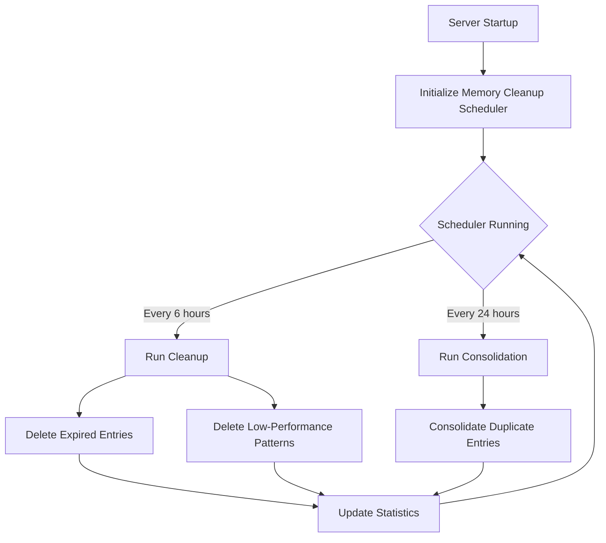

# Memory Cleanup Scheduler

Automated scheduled cleanup and consolidation for the GHL Agency AI memory system.

## Overview

The Memory Cleanup Scheduler automatically maintains the health of the agent memory system by:
- **Cleaning up expired entries**: Removes memory entries that have passed their TTL
- **Removing low-performance patterns**: Deletes reasoning patterns with poor success rates
- **Consolidating duplicate entries**: Merges duplicate memory entries to reduce storage

## Features

- ✅ **Automatic Scheduling**: Runs cleanup and consolidation on configurable intervals
- ✅ **Manual Triggering**: API endpoints to manually trigger cleanup jobs
- ✅ **Statistics Tracking**: Monitors cleanup performance and history
- ✅ **BullMQ Integration**: Optional queue-based processing for distributed systems
- ✅ **Graceful Shutdown**: Properly stops on server shutdown
- ✅ **Configurable**: Environment variables and runtime configuration

## Quick Start

### 1. Automatic Startup (Default)

The memory cleanup scheduler automatically starts when the server starts:

```typescript
// Automatically initialized in server/_core/index.ts
initializeMemoryCleanup().catch(console.error);
```

**Default Configuration:**
- Cleanup runs every **6 hours**
- Consolidation runs every **24 hours**
- Does **not** run immediately on startup

### 2. Environment Variables

Configure the scheduler using environment variables:

```bash
# Cleanup interval in hours (default: 6)
MEMORY_CLEANUP_INTERVAL_HOURS=6

# Consolidation interval in hours (default: 24)
MEMORY_CONSOLIDATE_INTERVAL_HOURS=24

# Run cleanup immediately on server startup (default: false)
MEMORY_CLEANUP_RUN_ON_STARTUP=true
```

### 3. Manual Control via API

Use tRPC endpoints to control the scheduler manually:

```typescript
// Trigger cleanup immediately
await trpc.memory.triggerCleanup.mutate({
  cleanupExpired: true,
  cleanupLowPerformance: true,
  minSuccessRate: 0.3,
  minUsageCount: 5,
});

// Trigger consolidation immediately
await trpc.memory.triggerConsolidation.mutate({
  sessionId: "session-123", // optional
  agentId: "agent-456",     // optional
});

// Get scheduler statistics
const stats = await trpc.memory.getCleanupStats.query();

// Start/stop scheduler
await trpc.memory.startCleanupScheduler.mutate({
  cleanupIntervalHours: 12,
  consolidateIntervalHours: 48,
  runImmediately: true,
});

await trpc.memory.stopCleanupScheduler.mutate();
```

## Architecture

### Component Structure

```
server/services/memory/
├── memoryCleanup.scheduler.ts    # Main scheduler service
├── agentMemory.service.ts         # Agent memory storage
├── reasoningBank.service.ts       # Reasoning pattern storage
└── index.ts                       # Memory system facade

server/workers/
└── memoryCleanup.worker.ts        # BullMQ worker processor

server/api/routers/
└── memory.ts                      # tRPC API endpoints
```

### How It Works



### Cleanup Process

**1. Expired Entry Cleanup**
- Finds all memory entries where `expiresAt <= NOW()`
- Deletes expired entries from database
- Clears expired entries from in-memory cache
- Returns count of deleted entries

**2. Low-Performance Pattern Cleanup**
- Finds reasoning patterns with:
  - Success rate < `minSuccessRate` (default: 0.3 or 30%)
  - Usage count >= `minUsageCount` (default: 5)
- Deletes patterns that consistently fail
- Helps maintain high-quality reasoning patterns

**3. Consolidation Process**
- Groups memory entries by session and key
- For duplicate keys:
  - Keeps the most recent entry
  - Merges metadata from older entries
  - Marks entry as consolidated
  - Updates consolidated count

## API Reference

### Memory Cleanup Scheduler Methods

```typescript
import { memoryCleanupScheduler } from 'server/services/memory';

// Start the scheduler
memoryCleanupScheduler.start({
  cleanupIntervalMs: 6 * 60 * 60 * 1000,      // 6 hours
  consolidateIntervalMs: 24 * 60 * 60 * 1000, // 24 hours
  runImmediately: false,
});

// Stop the scheduler
memoryCleanupScheduler.stop();

// Run cleanup immediately
const result = await memoryCleanupScheduler.runCleanup({
  cleanupExpired: true,
  cleanupLowPerformance: true,
  minSuccessRate: 0.3,
  minUsageCount: 5,
});

// Run consolidation immediately
const result = await memoryCleanupScheduler.runConsolidation({
  sessionId: "optional-session-id",
  agentId: "optional-agent-id",
});

// Get statistics
const stats = memoryCleanupScheduler.getStats();
console.log(stats);
// {
//   lastCleanupTime: Date,
//   lastConsolidationTime: Date,
//   totalCleanupsRun: 42,
//   totalConsolidationsRun: 7,
//   totalExpiredCleaned: 1523,
//   totalLowPerformanceCleaned: 38,
//   totalEntriesConsolidated: 256,
//   isRunning: true
// }

// Check if running
const isRunning = memoryCleanupScheduler.isSchedulerRunning();

// Update intervals
memoryCleanupScheduler.updateCleanupInterval(12 * 60 * 60 * 1000); // 12 hours
memoryCleanupScheduler.updateConsolidationInterval(48 * 60 * 60 * 1000); // 48 hours
```

### tRPC API Endpoints

**Trigger Cleanup**
```typescript
POST /api/trpc/memory.triggerCleanup
Body: {
  cleanupExpired?: boolean,
  cleanupLowPerformance?: boolean,
  minSuccessRate?: number,      // 0-1
  minUsageCount?: number
}
Response: {
  success: true,
  expiredCleaned: 42,
  lowPerformanceCleaned: 7,
  message: "Cleaned 42 expired entries and 7 low-performance patterns"
}
```

**Trigger Consolidation**
```typescript
POST /api/trpc/memory.triggerConsolidation
Body: {
  sessionId?: string,
  agentId?: string,
  threshold?: number  // 0-1
}
Response: {
  success: true,
  consolidatedCount: 15,
  message: "Consolidated 15 duplicate entries"
}
```

**Get Cleanup Statistics**
```typescript
GET /api/trpc/memory.getCleanupStats
Response: {
  success: true,
  stats: {
    lastCleanupTime: "2025-12-15T10:30:00Z",
    lastConsolidationTime: "2025-12-15T00:00:00Z",
    totalCleanupsRun: 42,
    totalConsolidationsRun: 7,
    totalExpiredCleaned: 1523,
    totalLowPerformanceCleaned: 38,
    totalEntriesConsolidated: 256,
    isRunning: true
  }
}
```

**Start/Stop Scheduler**
```typescript
POST /api/trpc/memory.startCleanupScheduler
Body: {
  cleanupIntervalHours?: number,
  consolidateIntervalHours?: number,
  runImmediately?: boolean
}

POST /api/trpc/memory.stopCleanupScheduler
```

## BullMQ Integration (Optional)

For distributed systems or to offload cleanup to worker processes:

```typescript
import { queueMemoryCleanup, queueMemoryConsolidation } from 'server/services/memory';

// Queue cleanup job
await queueMemoryCleanup({
  cleanupExpired: true,
  cleanupLowPerformance: true,
});

// Queue consolidation job
await queueMemoryConsolidation({
  sessionId: "session-123",
});
```

**Worker Setup** (server/workers/index.ts):
```typescript
import { Worker } from 'bullmq';
import { processMemoryJob } from './memoryCleanup.worker';

const memoryWorker = new Worker('workflow', processMemoryJob, {
  connection: redisConnection,
});

memoryWorker.on('completed', onMemoryJobCompleted);
memoryWorker.on('failed', onMemoryJobFailed);
```

## Configuration Examples

### Development Environment
```bash
# Run cleanup every hour, consolidate every 6 hours
MEMORY_CLEANUP_INTERVAL_HOURS=1
MEMORY_CONSOLIDATE_INTERVAL_HOURS=6
MEMORY_CLEANUP_RUN_ON_STARTUP=true
```

### Production Environment
```bash
# Conservative intervals for production
MEMORY_CLEANUP_INTERVAL_HOURS=6
MEMORY_CONSOLIDATE_INTERVAL_HOURS=24
MEMORY_CLEANUP_RUN_ON_STARTUP=false
```

### High-Traffic Environment
```bash
# Frequent cleanup for high-volume systems
MEMORY_CLEANUP_INTERVAL_HOURS=2
MEMORY_CONSOLIDATE_INTERVAL_HOURS=12
MEMORY_CLEANUP_RUN_ON_STARTUP=true
```

## Monitoring

### Log Output

The scheduler provides detailed logging:

```
[Memory Cleanup] Starting scheduler
  - Cleanup interval: 360 minutes
  - Consolidation interval: 24 hours
[Memory Cleanup] Starting cleanup job...
[Memory Cleanup] Cleanup completed in 1245ms
  - Expired entries cleaned: 42
  - Low-performance patterns cleaned: 7
[Memory Cleanup] Starting consolidation job...
[Memory Cleanup] Consolidation completed in 823ms
  - Entries consolidated: 15
```

### Health Checks

Monitor scheduler health via the memory health endpoint:

```typescript
const health = await trpc.memory.health.query();
// {
//   success: true,
//   healthy: true,
//   stats: { ... }
// }
```

## Best Practices

1. **Interval Selection**
   - Development: Short intervals (1-2 hours) for testing
   - Production: Longer intervals (6-24 hours) to reduce overhead
   - High-traffic: Medium intervals (2-6 hours) to prevent bloat

2. **Success Rate Thresholds**
   - Conservative: `minSuccessRate: 0.2` (20%) - keeps more patterns
   - Moderate: `minSuccessRate: 0.3` (30%) - default, balanced
   - Aggressive: `minSuccessRate: 0.5` (50%) - only keeps high-performers

3. **Usage Count Thresholds**
   - Low: `minUsageCount: 3` - evaluates patterns quickly
   - Medium: `minUsageCount: 5` - default, gives patterns time to prove themselves
   - High: `minUsageCount: 10` - more data before evaluation

4. **Graceful Shutdown**
   - The scheduler automatically stops on SIGTERM/SIGINT
   - No manual cleanup needed on server shutdown

5. **Manual Triggering**
   - Use before major releases to clean up old data
   - Run after importing large datasets
   - Trigger during low-traffic periods for large cleanups

## Troubleshooting

### Scheduler Not Running

**Check if scheduler is enabled:**
```typescript
const stats = await trpc.memory.getCleanupStats.query();
console.log(stats.stats.isRunning); // Should be true
```

**Restart the scheduler:**
```typescript
await trpc.memory.stopCleanupScheduler.mutate();
await trpc.memory.startCleanupScheduler.mutate();
```

### Database Connection Issues

The scheduler will log errors but continue running. Check server logs:
```bash
grep "Memory Cleanup" logs/app.log
```

### High Memory Usage

If cleanup jobs cause memory spikes:
- Increase cleanup intervals
- Use BullMQ workers to offload processing
- Run consolidation during off-peak hours

## Performance Impact

- **Cleanup**: ~100-500ms for 10,000 entries
- **Consolidation**: ~200-1000ms for 10,000 entries
- **CPU**: Minimal (<1% during execution)
- **Memory**: Temporary spike during consolidation (~50MB for 10,000 entries)

## Future Enhancements

- [ ] Configurable cleanup strategies (FIFO, LRU, etc.)
- [ ] Cleanup notifications (email, Slack)
- [ ] Backup before cleanup (optional)
- [ ] Metrics dashboard integration
- [ ] Custom cleanup rules via config
- [ ] Multi-tenant cleanup isolation

## Related Documentation

- [Memory System Overview](./README.md)
- [Agent Memory Service](./agentMemory.service.ts)
- [Reasoning Bank Service](./reasoningBank.service.ts)
- [Memory Router API](../../api/routers/memory.ts)
